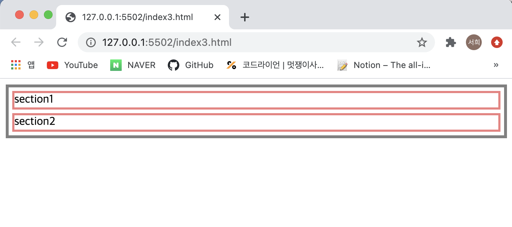

# 2주차 정리

| 주제   | 내용         |
| ---- | ------------- |
| 1. Float란 무엇일까 | float의 개념, 속성 |
| 2. Float 문제점| 부모 요소 - 자식 요소  |
| 3. 문제점 해결방법| overflow, 높이 설정, clear|


## 1. Float란 무엇일까?

### 1.1 Float 개념

📍 `float` 는 **'띄우다'**라는 뜻을 가지고 있으며 float 정렬은 다양한 객체를 띄워서 정렬하는 속성을 가진다.

[오리사진 첨부] 

📍 `float`는 글의 본문 안에서 이미지를 삽입할 때 이미지를 자연스럽게 삽입하기 위한 기법이며, 페이지의 레이아웃을 잡을 때도 사용한다.


```html

    <p>
        안녕하세요. 제 MBTI는 ESFP이구요, 사람들이랑 대화하면서 노는 것을 제일 좋아합니다. 여행가는 것을 좋아하는데 특히 자연을 좋아합니다. 그래서 제일 좋았던 여행지는 스위스랑 몽골이에요~ 위
        사진은 2019년에 몽골에 갔을 때 낙타 옆에서 찍은 사진입니다.
    </p>
```

```CSS
 img {
            width: 300px;
            float: left;
        }

        p {
            border: 3px solid skyblue;
            line-height: 25px;
        }
```


- float 적용 안한다면 이렇게 기본으로 '수직 배치'가 된다.

- 만약 사진 바로 옆에 글을 넣고 싶다면?


```html

    <p>
        안녕하세요. 제 MBTI는 ESFP이구요, 사람들이랑 대화하면서 노는 것을 제일 좋아합니다. 여행가는 것을 좋아하는데 특히 자연을 좋아합니다. 그래서 제일 좋았던 여행지는 스위스랑 몽골이에요~ 위
        사진은 2019년에 몽골에 갔을 때 낙타 옆에서 찍은 사진입니다.
    </p>
```

```CSS
 img {
            width: 300px;
            float: left;
        }

        p {
            border: 3px solid skyblue;
            line-height: 25px;
        }
```


- 사진 요소에 float를 넣어주면 된다!
- float 는 이렇게 수평 배치를 하고 싶을 때 사용할 수 있다.

+ 레이아웃 배치 시에도 설명 (index2.html)

### 1.2 Float 속성
`float`의 요소는 크게 4가지가 있다.

> - none: 기본 속성, 요소를 띄우지 않는다.
- left: 요소를 왼쪽으로 띄운다.
- right: 요소를 오른쪽으로 띄운다.
- inherit: 부모의 속성을 상속받는다.


## 2. Float 문제점 

🚨 부모 요소는 자식요소가 float 속성을 가질 때 자식 요소들의 높이를 인식하지 못하고 자신의 높이만 보여주는 문제 발생!

일단, 일반적인 상황을 살펴보자

```html
<!doctype html>
<html>
<head>
    <style>
        .wrap {
            border: 4px solid gray;
        }

        .content {
            margin: 5px;
            height: 20px;
            border: 3px solid lightcoral;

        }
    </style>
</head>

<body>
    <div class="wrap">
        <div class="content">section1</div>
        <div class="content">section2</div>
    </div>
</body>

</html>
```



- 우선 float 속성을 넣지 않았을 때는 정상적으로 부모가 자식의 높이를 반영해서 설정된 것을 확인할 수 있다.

❓만약 자식 요소에 float 속성을 추가한다면?
```html
<!doctype html>
<html>

<head>
    <style>
        .wrap {
            border: 4px solid gray;
        }

        .content {
            margin: 5px;
            height: 20px;
            border: 3px solid lightcoral;
            float: left;
        }
    </style>
</head>

<body>
    <div class="wrap">
        <div class="content">section1</div>
        <div class="content">section2</div>
    </div>
</body>

</html>
```


- 부모 요소가 자식을 인식하지 못하고 높이가 설정된 것을 확인할 수 있다.

❓❓❓ 왜그럴까?


- 브라우저는 요소를 화면에 어떻게 보여줄지 결정하는 여러 방법이 있다. 그 중에서 대표적으로 세가지 방법이 존재하는데 `normal flow`,  `float`,   `position`이 있다. 
- 대부분의 요소들, 블록 레벨 요소와 인라인 요소는 `normal flow` 에 따라 레이아웃이 결정 된다. 
- 하지만, float, position(absolute, fixed) 의 방법을 사용하면 `normal flow`에서 벗어나게 된다. 
🚨  `normal flow`에 속한 요소들은 `normal flow`에서 벗어난 float, position 속성이 적용된 요소들을 인식하지 못한다.

~~ float 속성을 갖는 애들은 집나갔다고 보면 된다. 부모도 집나간 자식은 신경 못써서 높이 반영 못해...  ~~

그렇다면, 자식에게 float를 주고 싶으면 어떻게 해야할까?

## 3. 문제점 해결방법

### 3.1 부모 요소에 **overflow 속성** 추가
- overflow는 block-formatting-contexts라는 것을 생성한다.
- bfc는 float 속성이 적용된 요소를 컨테이너가 인식하도록 만들어준다.
- `overflow:hidden` , `overflow:scroll` 등 `overflow:visible` 을 제외한 overflow 속성을 추가하여 해결한다.

```css
.wrap {
    border: 4px solid blue;
	overflow: hidden; 
	}
```


위에 코드에 `overflow:hidden`을 추가한 것이다.

### 3.2 부모 요소의 높이 값을 직접 지정
- 강제로 부모 높이를 주어 늘리는 것이므로 좋은 방법은 아니다.
- 자식 요소가 추가될 때 마다 부모 요소의 높이를 계속 수정해야하기 때문에 비효율적이다.

```css
.wrap {
    border: 4px solid blue;
	height: 35px;
	}
```


### 3.3 clear 속성 사용
📍`clear`는 float 속성을 해제해주는 것입니다.
- float이 사용된 요소의 바로 다음 형제 요소에 `clear` 속성을 사용
- `clear`속성은 left, right, both 세가지 값을 가진다.

📍`clear`의 요소
> - none: 아무런 해제를 하지 않는다.
- left: float:left를 해제한다.
- right: float:right를 해제한다.
- both: 모든 float(left,right)를 해제한다.
- inherit: 부모의 속성을 상속 받는다.

✅`clear` 속성이 지정된 영역 이후에는 더이상 `float`가 작동하지 않는다.

📍`clear-fix`방법
- CSS의 `::after` 가상요소로 해결
- 부모 요소에 가상으로 마지막 child를 붙여 clear 속성을 주고 wrap이 자식 요소들을 알아보게 하는 방법
- 이렇게 하면 부모 요소와 이후에 float요소를 따라오는 현상까지 모두 다 해결

```html
<!doctype html>
<html>

<head>
    <style>
        .wrap {
            border: 4px solid gray;

        }

        .content {
            margin: 5px;
            height: 20px;
            border: 3px solid lightcoral;
            float: left;
        }
    </style>
</head>

<body>
    <div class="wrap">
        <div class="content">section1</div>
        <div class="content">section2</div>
    </div>
</body>

</html>
```


- 자식 요소가 float 속성이 있어서 부모요소가 자식요소의 높이를 알아보지 못하는 상황

📍여기에 가상요소를 추가하여 float 속성을 제거하는 clear을 사용해주어 부모가 자식요소를 알아보도록 해보자!

```css
.wrap::after {
            content: '';
            display: block;
            clear: both;
        }
```


### 3.4 이외에도 block-formatting-contexts를 만들어내는 여러가지 방법 사용 가능
 외부링크: <https://www.w3.org/TR/CSS21/visuren.html#normal-flow/>
 위에 링크 참고!
------


